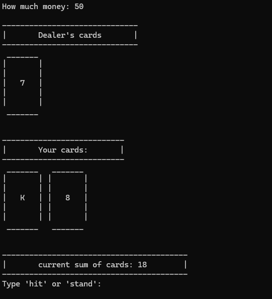
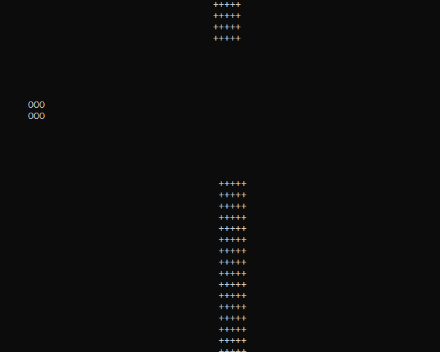
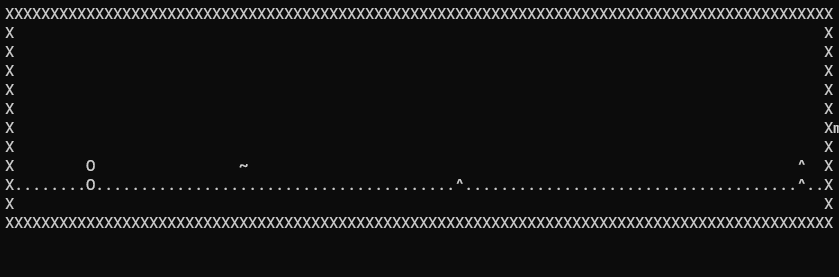
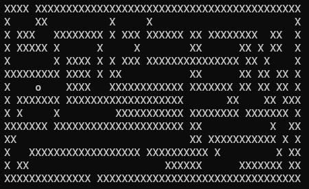
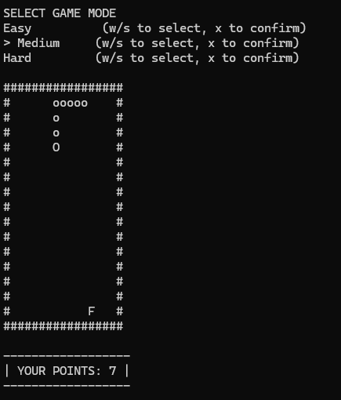
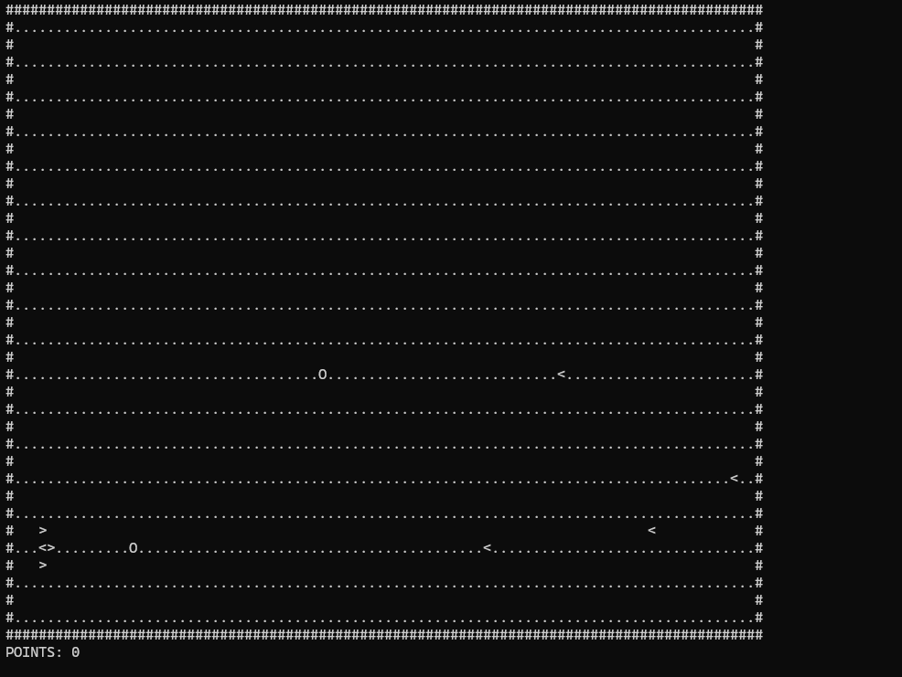

# Console Games Collection

> A collection of console-based games written in C/C++ as a passion project in 2024.  
> These run entirely in the Windows terminal using ASCII art and the Console API - no graphics engine.

---

## Games

| Game | Description |
|------|-------------|
| **Blackjack** | Classic card game - beat the dealer |
| **FloppyBirds** | Navigate a bird through obstacles |
| **GoogleDino** | Chrome dinosaur runner, recreated in the terminal |
| **MazeSolver** | Watch an algorithm solve a maze in real-time (map loaded from a txt file, swappable) |
| **Snake** | The legendary Nokia classic |
| **SpaceGame** | Shoot enemies in space |

---

## Project Structure

```
Games_Archive/
├── game_lib/           # Shared utility library
│   ├── game_lib.cpp
│   ├── game_lib.h
│   └── main.cpp
├── games/
│   ├── Blackjack/
│   ├── FloppyBirds/
│   ├── GoogleDino/
│   ├── MazeSolver/
│   ├── Snake/
│   └── SpaceGame/
└── README.md
```

---

## What I Learned

- **Bitwise Input Handling** - bit flags (`1 << 0`, `1 << 1`, …) for simultaneous key presses and diagonal movement
- **Dynamic Memory Management** - 2D arrays with `malloc`, pointer arithmetic, manual memory allocation
- **Windows Console API** - `SetConsoleCursorPosition`, `_kbhit()`, `_getch()` for cursor control and non-blocking input
- **Game Loop Architecture** - `Sleep()`-based timing, separated input / update / render phases
- **Collision Detection** - point-based and object-based systems
- **Pathfinding Basics** - simple follow/chase AI for enemies in `game_lib` (probably the most fun one)
- **Code Reusability** - shared `game_lib`: 2D board system, point/obstacle classes, collision, enemy AI

---

## Requirements

- Windows OS
- MinGW GCC/G++ compiler

---

## How to Compile & Run

> **Tip:** If you see rendering glitches, maximize or fullscreen your terminal window.

### Blackjack
```powershell
g++ games/Blackjack/blackjack.c games/Blackjack/karty.c games/Blackjack/main.c -o blackjack.exe
.\blackjack.exe
```



### FloppyBirds
```powershell
g++ games/FloppyBirds/main.cpp games/FloppyBirds/func.cpp -o floppybird.exe
.\floppybird.exe
```



### GoogleDino
```powershell
g++ games/GoogleDino/main.cpp games/GoogleDino/game.cpp games/GoogleDino/func.cpp -o dino.exe
.\dino.exe
```



### MazeSolver
```powershell
g++ games/MazeSolver/main.cpp games/MazeSolver/game_lib.cpp -o maze.exe
.\maze.exe
```



### Snake
```powershell
g++ games/Snake/snake.cpp -o snake.exe
.\snake.exe
```



### SpaceGame
```powershell
g++ games/SpaceGame/SpaceGame.cpp games/SpaceGame/func.cpp -o spacegame.exe
.\spacegame.exe
```




---

Maybe back then I didn't know how handle graphics and ux but that never stopped me ig